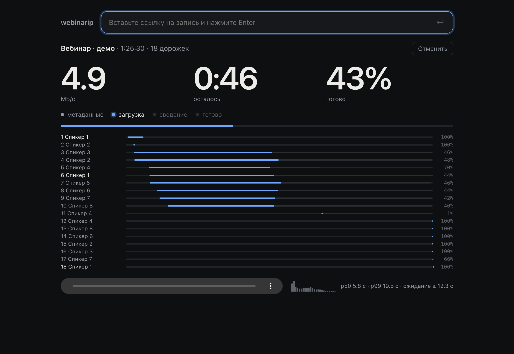

# webinarip

Downloads an MTS Link webinar recording as one file: **an 85-minute webinar to MP3 in {{HEADLINE}} s** from an empty cache. Every participant's audio is mixed into one track; participants' videos, their separate tracks and an editing timeline are one flag away. One ~4 MB binary, no dependencies.

[Русский](README.md)

> Only for recordings you have the rights to: your own webinars, or with the organiser's permission.
> An independent project, not affiliated with MTS or MTS Link.



## Install

- **Prebuilt binary** — [Releases](https://github.com/nilysenok/webinarip/releases): macOS (Apple Silicon, Intel), Linux (x86_64, arm64), Windows (x86_64).
- **macOS and Linux** in one line:
  ```sh
  curl --proto '=https' --tlsv1.2 -LsSf https://github.com/nilysenok/webinarip/releases/latest/download/webinarip-installer.sh | sh
  ```
- **Windows** (PowerShell):
  ```powershell
  powershell -ExecutionPolicy Bypass -c "irm https://github.com/nilysenok/webinarip/releases/latest/download/webinarip-installer.ps1 | iex"
  ```
- **From source** (Rust 1.85+): `cargo install --git https://github.com/nilysenok/webinarip webinarip`

## Examples

```sh
# The whole recording as MP3 (mono 64 kbit/s for speech; --quality high for stereo 128)
webinarip https://my.mts-link.ru/j/…/record-new/123456789

# From minute 10 to 1:20:00, only the host and track 3, 16 kHz WAV for transcription
webinarip <link> --from 10:00 --to 1:20:00 --tracks host,3 --quality low --wav

# MP3 + every participant's video (WebM) + their original tracks + an editing timeline
webinarip <link> --both --multicam
```

`webinarip <link> --list` shows the tracks with their numbers; `webinarip serve` opens the interface in the browser: paste a link and the download starts, the player plays while the file is still coming in, history is kept.

Times in `--from/--to`: `75` is seconds, `10:00` is minutes and seconds (as in ffmpeg), `1:20:00` or `1h20m` include hours. Every run puts its result into its own `YYYY-MM-DD_HHMM <title>/` folder; downloaded segments are cached, so another format or range of the same recording downloads nothing again.

## Private recordings: the session id in 3 steps

1. Open the recording in your browser, signed in.
2. Developer tools (F12 or ⌥⌘I) → Application → Cookies → `my.mts-link.ru`.
3. Copy the `sessionId` value and pass it: `--session-id <value>` or the `WEBINARIP_SESSION_ID` variable. It is never written to disk.

## How it works

1. A recording is a set of parallel media sessions: each participant has a track with its own start time.
2. Only the audio rendition (~100 kbit/s) of each track's HLS is downloaded; video only when asked for.
3. Tracks play at the same time, so they cannot be joined end to end: they are mixed on one timeline at their start times (a plain sum plus a limiter).
4. Mixing and encoding run while the download is still going; the segment the mixer waits for jumps the queue.
5. HTTP/1.1 only: the server limits the speed of each connection, and HTTP/2 with its single connection is 7.7× slower — hence many connections, but never more than 256.

## Benchmark

One recording (85 minutes, 18 participant tracks), one series back to back on {{BENCH_DATE_EN}}, macOS arm64, one network. Each tool starts with an empty cache in its own folder; limit 30 minutes.

{{BENCH_TABLE_EN}}

mtslinker and mtslinkdownloader do a different job — they render one combined video with a camera layout and re-encoding, and have no audio-only mode; the table says what each tool produces.

## Limitations

- **Video is what the service recorded.** In the tested recording the cameras are 320×180 at 25 fps: webinarip copies frames without re-encoding and does not improve quality.
- **WebM (VP9) does not open in QuickTime.** For QuickTime and editors there is `--mp4`: re-encoding with the system ffmpeg, minutes rather than seconds.
- **Participants' tracks (.m4a) are cut at segment boundaries, ~13 s:** they are the original bytes, not re-encoded. Offsets in the editing timeline account for it.
- **FCPXML import into Final Cut Pro and DaVinci Resolve has not been tested.** The file follows the spec and passes an XML check; EDL (CMX3600) is single-track by design.
- **AAC** (`--aac`) is encoded by the system AudioToolbox on macOS and by the system ffmpeg on Linux and Windows.

## Ethics

- **A hard ceiling of 256 simultaneous connections.** Lower is possible (`--connections`), higher is not.
- **HTTP 429 is honoured:** the number of connections is halved and every request waits for `Retry-After`.
- **Only your own recordings,** or ones you have permission for. The session id lives in the process memory only and is never stored.

## License and author

MIT © [Nikita Lysenok](https://nikita.lysenok.com)

MP3 encoding uses [LAME](https://lame.sourceforge.io) (LGPL), linked statically into the binary.
